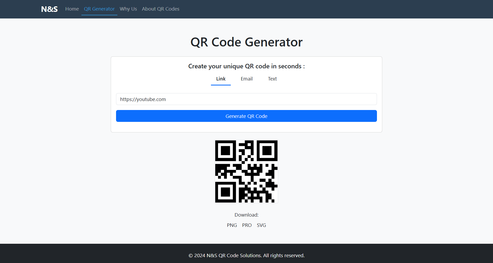
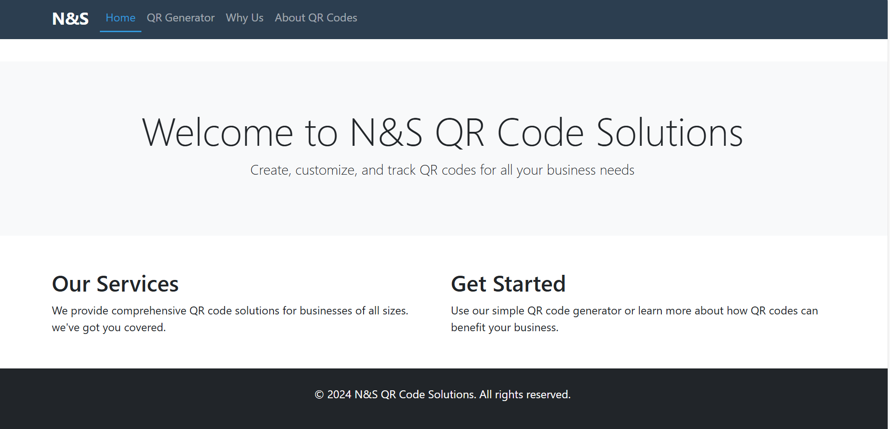
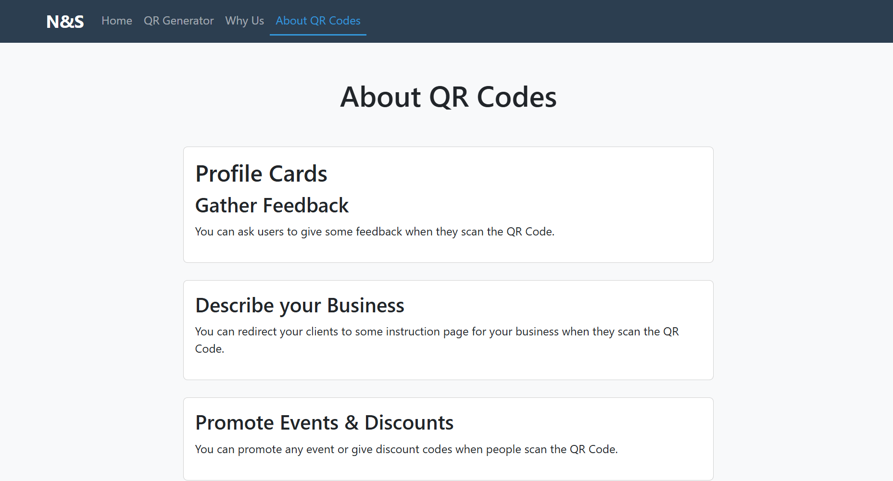

# 🚀 N&S QR Code Solutions

[](LICENSE)


A responsive web application for generating customizable QR codes in various formats (URL, Email, Text) with download options.



## ✨ Features

- **Multi-format QR generation**:
  - Website URLs
  - Email addresses
  - Plain text content
- **Download options**:
  - PNG format
  - SVG format (pro)
  - High-resolution versions
- **User-friendly interface**:
  - Tab-based navigation
  - Responsive design
  - Visual feedback during generation

## 🛠️ Technologies Used

- **Frontend**:
  - HTML5, CSS3, JavaScript
  - Bootstrap 5.3
- **Backend** :
  - Node.js (for QR generation API)

## 📸 Screenshots

### Main Interface



### why us

![Why us]!(image-2.png)

### about us



## 🚀 Quick Start

1. Clone the repository:
   ```bash
   git clone https://github.com/yourusername/ns-qr-generator.git
   cd ns-qr-generator
   ```
